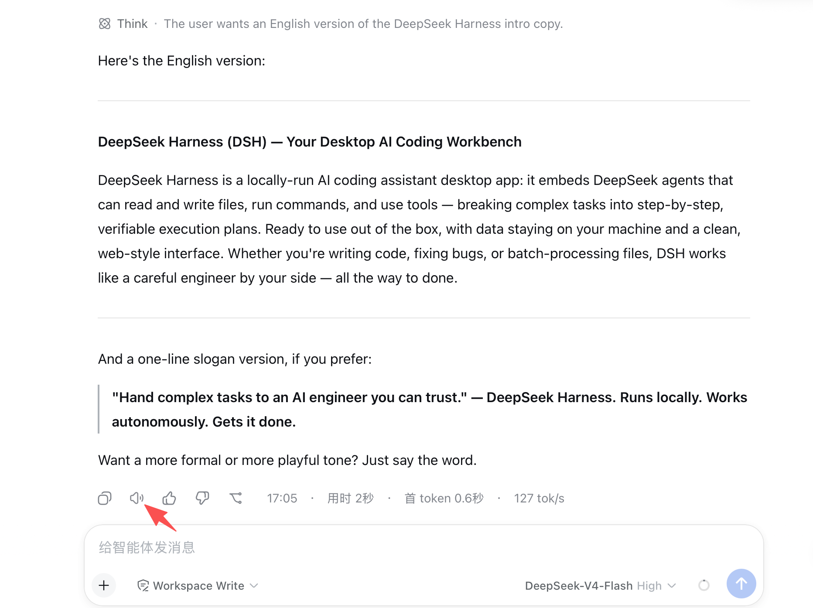
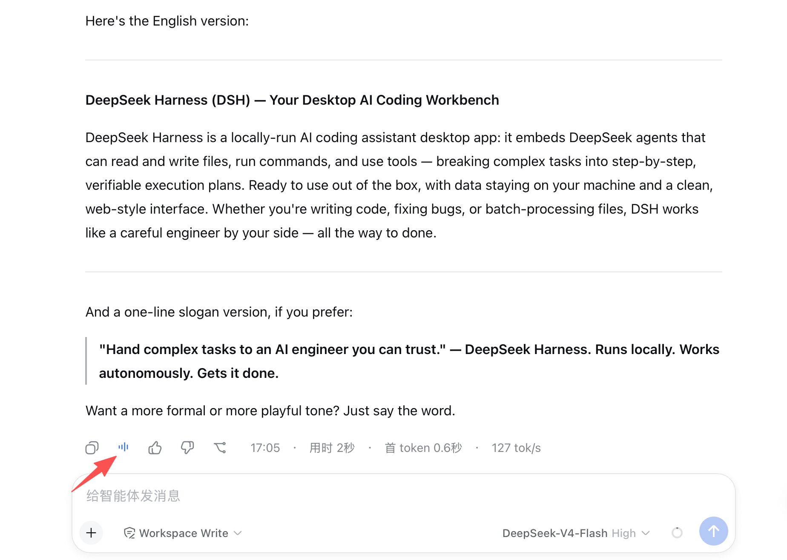
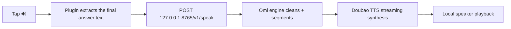
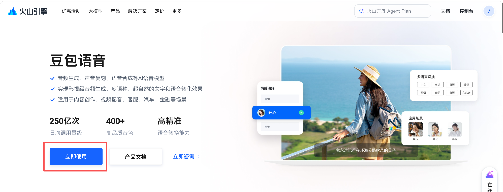
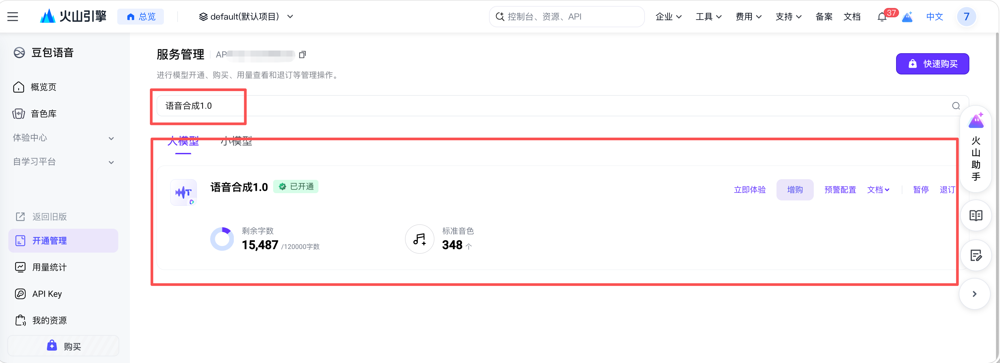
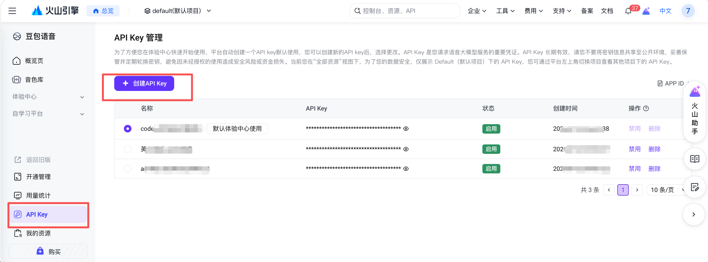
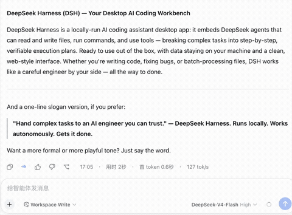

[中文](README.md) | **English**

<h1 align="center">dsh-omi-voice</h1>

<p align="center"><strong>Immersive read-aloud · Doubao voice quality</strong></p>
<p align="center">Tap 🔊 to hear AI replies in a natural Doubao voice — no copying, no auto-read</p>
<p align="center">DeepSeek Harness plugin · BYOK · MIT</p>

[](https://awesome-dsh-plugin.com)

Hear AI replies in DeepSeek Harness (DSH) spoken aloud in a **natural Doubao TTS voice**. Voice synthesis runs in a local Omi engine on your Mac, and your **Doubao API Key stays in your own Keychain (BYOK)** — the plugin never touches your key.

<p align="center">
  
  
</p>

## Overview

| Item | Description |
|---|---|
| Name | `dsh-omi-voice` |
| Platform | DeepSeek Harness (`dsh web`, incl. desktop) + macOS Omi engine v0.1.3+ |
| Problem solved | DSH's built-in TTS (system voice / Edge TTS) sounds robotic; clipboard tools force you to copy first |
| How it works | Tap 🔊 on a reply to read / pause / resume; reads only the final answer — tool logs, code, tables, diagrams are filtered out before synthesis |
| Voice | Doubao TTS 1.0 (`seed-tts-1.0`), natural Chinese voice, pause/resume from where you paused |
| Privacy | API Key lives in the Omi engine's macOS Keychain; plugin has zero key access; localhost-only (`127.0.0.1`) |
| Cost | BYOK, billed by character; in-memory LRU cache + dedup avoid repeat billing |
| License | [MIT](LICENSE) |

## Get started in 3 steps

1. Install the plugin and build/open the Omi engine (see "Getting a Doubao API Key" and "Installation" below).
2. Save your Doubao API Key once in the Omi engine settings.
3. Tap 🔊 next to any AI reply in DSH to hear it.



## Getting a Doubao API Key (first-time users)

This plugin is **BYOK**: Doubao speech is billed to your own Volcengine account by character count. Three steps:

**Step 1 · Find "Doubao Speech"**: log in to the [Volcengine Console](https://console.volcengine.com/) and open the "Doubao Speech" (speech technology) service.

<p align="center"></p>

**Step 2 · Enable "Speech Synthesis 1.0"**: enable the "Speech Synthesis 1.0" product in the service list.

<p align="center"></p>

**Step 3 · Create an API Key**: when creating an Access Key, **link it to the "Speech Synthesis 1.0" service** you enabled; paste the resulting API Key into the Omi engine settings ("Settings > API Key") and save.

<p align="center"></p>

> The API Key is stored only in the Omi engine's macOS Keychain — the plugin has zero key access and nothing leaves your machine.

## Installation

```bash
dsh plugin --profile web add "github:PolinniZhong/dsh-omi-voice#v0.1.3&path:/"
```

For local development you can install a directory directly:

```bash
dsh plugin --profile web add /path/to/dsh-omi-voice
```

Engine (Omi DSH) build steps: see [engine/README.md](engine/README.md) — run `./engine/build/build-service.sh`, then `ditto` the result to `~/Applications/Omi DSH.app`.

## Usage

<p align="center">
  
</p>

- **Tap 🔊 to read**; tap again while playing = **pause**; tap again = **resume from where you paused**; tapping 🔊 on another message interrupts and reads the new one.
- **Reads only the final answer**: tool execution logs and thinking are not read; code fences, tables, and pure graphics (box-drawing/ASCII) are filtered before the request — replies containing only such content show a disabled button with "nothing to read".
- When the engine is off or the key is missing, tapping shows a clear hint (including where to open Omi).

## Cost transparency

Doubao TTS (`seed-tts-1.0`) is billed **by character** to your Volcengine account. Therefore:

- Synthesis happens **only when you manually tap 🔊** — no auto-read;
- The engine dedups identical text within 3 seconds and keeps an in-memory LRU cache (last 3 items, ≤5MB, memory-only, cleared on quit) so re-reading recent content doesn't re-bill;
- Replies with no speakable content (pure tables/code) never hit the TTS API (`invalid_text`).

## Architecture & protocol

The plugin is just a "remote control": playback, speed, pause/resume, caching, and text cleaning all happen in the Omi engine. Protocol: [docs/API.md](docs/API.md) (`/v1/status`, `/v1/speak`, `/v1/pause`, `/v1/resume`, `/v1/stop`).

## FAQ

| Question | Answer |
|---|---|
| Tap 🔊 shows "Omi DSH engine not detected" | Open the "Omi DSH" app (`~/Applications` or press ⌘Space and search "Omi"); consider enabling "Launch at login" |
| "Configure your Doubao API Key in Omi settings" | Open "Omi DSH" settings and save the key once (see "Getting a Doubao API Key") |
| Button is greyed out / nothing happens | The reply has no readable content (pure code/table/diagram), auto-filtered |
| Can I change the voice? | Yes, via the Omi engine settings "Voice ID" (the plugin has no voice picker yet) |
| Windows support? | Not yet — the Omi engine is macOS Apple Silicon only |
| vs. dsh-voice-chat | It is free/no-key but uses the robotic system voice; this plugin uses the natural Doubao voice at the cost of BYOK character billing |

## Related

- Engine: [this repo's `engine/`](engine/README.md) (Omi DSH local engine, Swift source + build scripts)
- Ecosystem: [awesome-dsh-plugin](https://github.com/beancookie/awesome-dsh-plugin)

## Project docs

- [AGENTS.md](AGENTS.md) — agent instructions (Codex convention)
- [docs/DESIGN.md](docs/DESIGN.md) — architecture & design
- [docs/DECISIONS.md](docs/DECISIONS.md) — design decision log
- [docs/MEMORY.md](docs/MEMORY.md) — long-term knowledge (gotchas & conclusions)
- [docs/HANDOFF.md](docs/HANDOFF.md) — handoff & continuation
- [docs/API.md](docs/API.md) — local protocol

## License

MIT
