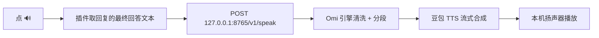

<h1 align="center">dsh-omi-voice</h1>

<p align="center">豆包音质 · 有温度的对话内朗读</p>
<p align="center">DeepSeek Harness 插件 · BYOK · MIT</p>

[](https://awesome-dsh-plugin.com)

让 DeepSeek Harness（DSH）桌面端里的 AI 回复，用**豆包自然音色**读给你听——点一下 🔊 即可，无需复制，不做自动朗读。语音由你本机常驻的 Omi 引擎合成，**豆包 API Key 只留在你自己的钥匙串里（BYOK）**。

## 快速概览

| 项目 | 说明 |
|---|---|
| 插件名称 | `dsh-omi-voice` |
| 适配平台 | DeepSeek Harness（`dsh web`，含桌面端）+ macOS 上的 Omi 引擎 v0.1.2+ |
| 解决的问题 | DSH 内置朗读（系统语音 / Edge TTS）音色机械、像上个时代的播报腔；通用剪贴板工具又要先复制再读 |
| 工作方式 | 点回复旁 🔊 朗读/暂停/继续；只读最终回答，工具日志/代码/表格/图形朗读前自动过滤 |
| 语音能力 | 豆包 TTS 1.0（`seed-tts-1.0`），自然中文音色，支持暂停/继续（从暂停处续播） |
| 隐私特性 | API Key 存入 Omi 引擎的 macOS Keychain；插件零 Key；仅本机 `127.0.0.1` 通信 |
| 成本 | BYOK，按字符计费；内存 LRU 缓存 + 去重，避免重复请求 |
| 开源协议 | [MIT License](LICENSE) |

## 三步开始朗读

1. 安装插件并重启 DSH；打开 Omi 引擎（可在「设置 > 应用偏好 > 开机启动」设为常驻）。
2. 在 Omi 引擎设置页保存一次豆包 API Key。
3. 在 DSH 对话里点 AI 回复旁的 🔊，即可朗读。



## 安装

```bash
dsh plugin --profile web add "github:PolinniZhong/dsh-omi-voice#v0.1.2&path:/"
```

本地开发可直接装目录：

```bash
dsh plugin --profile web add /path/to/dsh-omi-voice
```

## 使用

- **🔊 点读**；播放中再点 = **暂停**，再点 = **从暂停处继续**；点其它消息的 🔊 = 打断并读新的。
- **只读最终回答**：工具执行日志、思考过程不会读；代码围栏、表格、纯图形（盒绘/ASCII）在请求前过滤，回复若只有这些内容，按钮呈禁用态并提示"没有可朗读的内容"。
- 引擎未启动 / 未配置 Key 时，点击会给出明确提示（含去哪打开 Omi）。

## 成本透明

豆包 TTS（`seed-tts-1.0`）按**字符数**计费，由你在火山引擎账户自行承担。为此：

- 只有**手动点 🔊** 才合成，不自动朗读；
- 引擎对相同文本 3 秒内去重，且进程内 LRU 缓存最近 3 条（≤5MB、纯内存、退出即清），重复朗读不重复计费；
- 纯表格/纯代码等无有效内容不发请求（`invalid_text`）。

## 架构与协议

插件只是"遥控器"：播放、变速、暂停/继续、缓存、文本清洗全部在 Omi 引擎内完成。协议见 [docs/API.md](docs/API.md)（`/v1/status`、`/v1/speak`、`/v1/pause`、`/v1/resume`、`/v1/stop`）。

## FAQ

| 问题 | 回答 |
|---|---|
| 点 🔊 提示"未检测到 Omi DSH 引擎" | 打开应用「Omi DSH」（`~/Applications` 或 ⌘空格 搜 "Omi"），建议开「开机启动」 |
| 提示"请先在 Omi 设置页配置豆包 API Key" | 打开「Omi DSH」设置，填一次 Key 并保存 |
| 按钮是灰的 / 点它没反应 | 这条回复没有可朗读的内容（纯代码/表格/图形），已自动过滤 |
| 音色能换吗 | 在 Omi 设置页「音色 ID」改（当前插件不提供音色 UI） |
| 支持 Windows 吗 | 暂不支持：Omi 引擎仅 macOS Apple Silicon |
| 和 dsh-voice-chat 的区别 | 它零 Key 零成本但用系统机械音色；本插件用豆包自然音色，代价是 BYOK 按字符计费 |

## 相关

- 引擎：[本仓库 `engine/`](engine/README.md)（Omi DSH 本地引擎，Swift 源码 + 构建脚本）
- 生态：[awesome-dsh-plugin](https://github.com/beancookie/awesome-dsh-plugin)

## License

MIT
